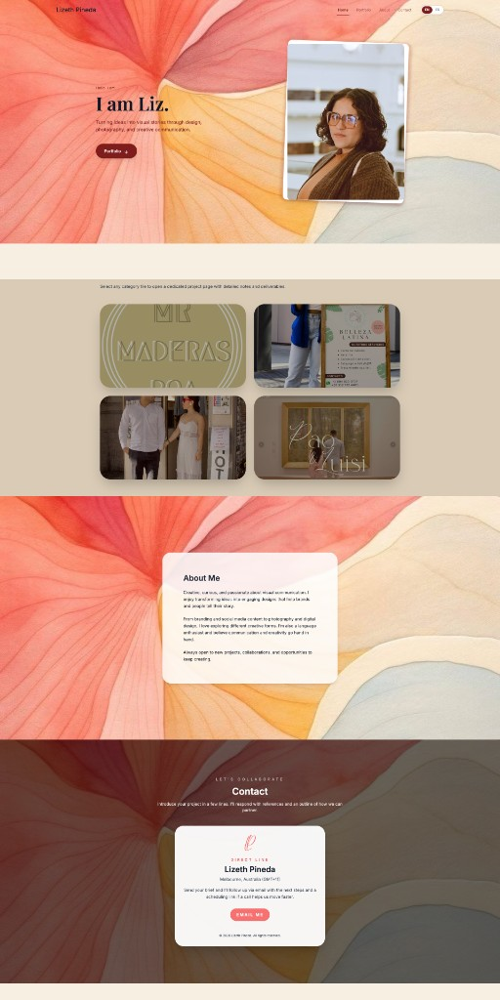

# Lizeth Pineda Portfolio

> A bilingual creative portfolio showcasing branding, marketing, photography, and digital design work.



**Live:** [https://lizethpineda.netlify.app/](https://lizethpineda.netlify.app/)  
**Status:** Production

## Why this project

Lizeth Pineda needed a personal site to present her work to potential clients and collaborators — not just a gallery of images, but a clear story across branding, marketing, photography, and UX. The site serves visitors who want to browse quickly on the home page, then dive into category detail pages with videos, sliders, and project notes. An EN/ES toggle lets her reach both English- and Spanish-speaking audiences without maintaining two separate sites.

## Tech stack

- **React 19** — UI components and section-based home page
- **Vite 8** — dev server and production build
- **React Router 7** — client-side routes (`/`, `/category/:slug`)
- **Tailwind CSS 3** — layout, responsive design, design tokens
- **Framer Motion** — header, hero, and CTA animations
- **Lucide React** — icons (menu, arrow, scroll-to-top)
- **Netlify** — static hosting with SPA fallback

## Key technical decisions

- **Separated content from UI** — portfolio projects live in `src/data/portfolio.js` and copy in `src/data/i18n.js`, so Liz can update work and text without touching components.
- **React Router over manual history** — declarative routes replace hand-rolled `pushState`, making category pages and deep links predictable; `public/_redirects` handles SPA fallback on Netlify.
- **Full-viewport sections with scroll spy** — each home section uses `min-height: 100dvh` and `useActiveSection` drives the header underline so navigation reflects where the user actually is.
- **CSS variables for brand colors** — merlot, terracotta, and header tokens live in `:root` (`src/index.css`) so theme tweaks do not require hunting through JSX.

## Getting started

**Prerequisites:** Node.js 18+ (20 LTS recommended — see `.nvmrc`), npm.

```bash
git clone <repository-url>
cd lizeth-pineda-portfolio
nvm use          # optional
npm install
npm run dev      # http://localhost:5173
```

| Command | Description |
|---------|-------------|
| `npm run dev` | Start local dev server |
| `npm run build` | Production build → `dist/` |
| `npm run preview` | Preview production build locally |

### Deploy (Netlify)

| Setting | Value |
|---------|--------|
| Build command | `npm run build` |
| Publish directory | `dist` |

## Project structure

```
src/
├── App.jsx                    # BrowserRouter + route definitions
├── main.jsx                   # React entry point
├── pages/
│   ├── HomePage.jsx           # Composes home sections
│   └── CategoryPageRoute.jsx  # Loads category data by slug
├── components/
│   ├── layout/                # Header, SiteLayout, ScrollToTop, LanguageToggle
│   ├── sections/              # Hero, AboutMe, Portfolio, Contact
│   └── portfolio/             # CategoryPage, media, image slider
├── data/
│   ├── portfolio.js           # Categories, images, videos, captions
│   └── i18n.js                # EN/ES strings for home sections
├── constants/                 # Site name, email, nav labels
├── context/                   # LanguageProvider (EN/ES)
├── hooks/                     # Scroll spy, hash scroll, scroll threshold
└── lib/                       # scroll helpers, portfolio utils, cn()
public/                        # Static assets (images, videos, favicon)
docs/                          # README screenshot
```

Imports use the `@/` alias → `src/` (configured in `vite.config.js`).

### Quick content edits

| What | File |
|------|------|
| Portfolio projects | `src/data/portfolio.js` |
| EN/ES home copy | `src/data/i18n.js` |
| Menu labels | `src/constants/navigation.js` |
| Name, email, location | `src/constants/site.js` |
| Brand colors | `src/index.css` (`:root` variables) + `tailwind.config.js` |

## What I learned

Building this site meant balancing a **design-heavy layout** (full-screen sections, transparent header, animated hero) with **maintainability for a non-developer**. Pulling all portfolio data into plain JS objects made updates safe and fast. Scroll-based active navigation and hash links (`/#portfolio`) interact in subtle ways — testing on real viewport heights (`100dvh`) mattered more than assuming `100vh`. Tailwind's `@apply` fails on nested custom colors inside `@layer`, so CSS variables were the reliable escape hatch for nav and toggle styles.

## What I'd improve next

- **Translate portfolio category content** — project titles and descriptions in `portfolio.js` are still English-only; i18n could extend there.
- **CMS or JSON editor** — move content out of the repo so Liz can update projects without a code deploy.
- **Automated tests** — smoke tests for routes and a11y checks on navigation and language toggle.
- **Image optimization** — responsive `srcset` or a build-time pipeline for large photos and videos in `public/`.
- **Reduced motion** — respect `prefers-reduced-motion` for Framer Motion animations.

## Credits

- **Portfolio, design & content:** [Lizeth Pineda](https://lizethpineda.netlify.app/)
- **Built with:** React, Vite, Tailwind CSS, Framer Motion

All portfolio imagery and media belong to Lizeth Pineda unless otherwise noted. All rights reserved.
